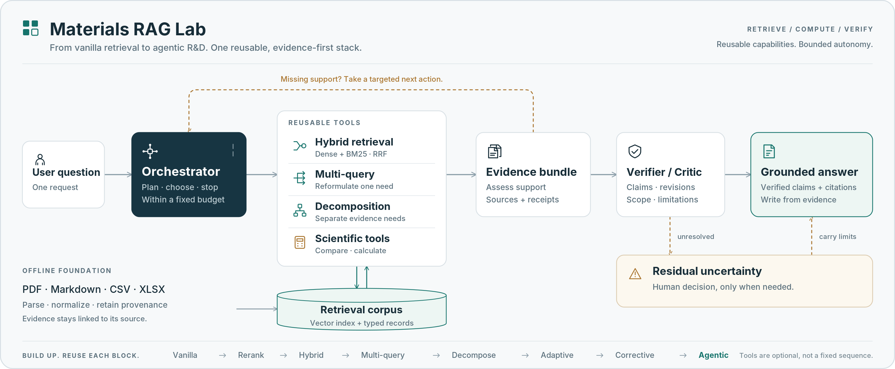
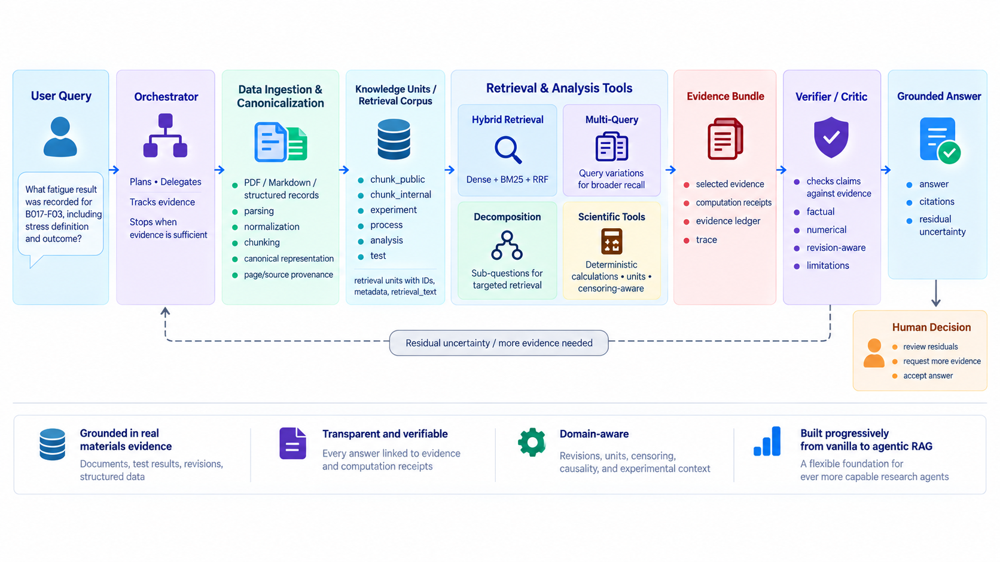

# Materials RAG Lab: From Vanilla RAG to Agentic R&D

[](pyproject.toml)
[](LICENSE)
[](https://doi.org/10.5281/zenodo.22837229)

**A reproducible materials R&D RAG testbed that builds from Vanilla Dense Retrieval to evidence-aware Agentic RAG over heterogeneous documentary and structured experimental data.**

## Introduction

Materials RAG Lab is an evaluation-first reference implementation for retrieval-augmented generation in materials engineering. Its running example combines public NASA and NIST evidence about IN718 additive manufacturing with a controlled fictional internal corpus for testing provenance, revision status, fatigue runouts, hard negatives, missing evidence, and bounded causal claims.

The repository exposes a progressive ladder. A reader can stop at simple Dense or Hybrid retrieval, add query transformations when justified, or run a bounded evidence-aware controller. Advanced levels import lower-level implementations rather than replacing them with an agent framework.

<p align="center">
  <picture>
    <source srcset="docs/assets/hero/materials-rag-hero.gif" type="image/gif">
    
  </picture>
</p>

## Choose your path

| Goal | Start here |
|---|---|
| I want the simplest RAG | [Vanilla Dense Retrieval](docs/quickstarts.md#vanilla-dense-retrieval) |
| I want strong practical retrieval | [Hybrid Retrieval](docs/quickstarts.md#hybrid-retrieval) |
| I have terminology-sensitive or compound questions | [Multi-query and Decomposition](docs/quickstarts.md#query-transformations) |
| I want evidence-aware automation | [Agentic RAG](docs/agentic_rag.md) |
| I want to reproduce v0.1.0 | [Reproducibility guide](docs/reproducibility.md) |

Agentic RAG is optional. Hybrid was a strong simple baseline in this benchmark.

## Progressive capability ladder

| Level | Capability | What it adds |
|---:|---|---|
| 00 | Data and knowledge preparation | Parsing, normalization, canonical records, Knowledge Units, and provenance |
| 01 | Vanilla Dense Retrieval | BGE embeddings and exact cosine ranking |
| 02 | Reranking | Cross-encoder ordering of Dense candidates |
| 03 | Hybrid Retrieval | Dense + BM25 fused with Reciprocal Rank Fusion |
| 04 | Multi-query | Three reformulations with second-stage RRF |
| 05 | Decomposition | Independent retrieval for atomic evidence needs |
| 06 | Adaptive Routing | Question-only selection of one existing strategy |
| 07 | Corrective RAG | Evidence Ledger plus one bounded alternate strategy |
| 08 | Agentic Retrieval | Evidence-aware targeted actions under fixed budgets |
| 09 | Scientific Computation | Typed deterministic calculations and receipts |
| 10 | Verified Agentic RAG | Claim verification, grounded answer assembly, and residuals |

## Quick start

```bash
uv sync --locked --dev
uv run materials-rag-lab doctor
uv run python experiments/00_data_and_knowledge_preparation.py
uv run materials-rag-lab data install /path/to/materials-rag-data-v0.1.0.zip --check
uv run materials-rag-lab data install /path/to/materials-rag-data-v0.1.0.zip
uv run materials-rag-lab models prepare
uv run materials-rag-lab doctor --capability hybrid
uv run materials-rag-lab retrieve --method hybrid --query "IN718 fatigue runout stress definition"
```

With a reconstructed 277-unit corpus and compatible authenticated Codex runtime:

```bash
uv run materials-rag-lab data reconstruct --source-root /path/to/authorized-sources --output data/runtime
uv run materials-rag-lab doctor --capability agentic
uv run materials-rag-lab ask "What fatigue result was recorded for B017-F03, including stress definition and outcome?" --output run.json
```

The `ask` artifact exposes actions, Evidence Ledger state, selected evidence, verified claims, residual uncertainty, and cost counters. It does not expose hidden reasoning. See [Quickstarts](docs/quickstarts.md), [Data setup](data/README.md), and [Model/runtime setup](docs/model_runtime.md).

## Architecture at a glance

Raw evidence becomes canonical source-aware objects and Knowledge Units before retrieval begins. The bounded controller composes existing retrieval and scientific tools, then verifies claims before answer assembly. Residual uncertainty remains visible to the human decision maker.

<p align="center">
  
</p>
<p align="center"><em>Source truth, retrieval representations, derived computation receipts, and verified answers remain distinct provenance layers.</em></p>

## How orchestration works

The orchestrator starts conservatively. Direct questions generally use Hybrid Retrieval; terminology-sensitive questions may use Multi-query; compound questions may use Decomposition. After each evidence-producing action, the Evidence Ledger is reassessed. A missing fact can trigger targeted Hybrid search, revision ambiguity can trigger deterministic revision lookup, and a numerical requirement can invoke the registered Scientific Analyst and deterministic computation executor. The system stops when evidence is sufficient or when its bounded tool/action budget cannot resolve the residual.

The router and next-action controller are model-guided under fixed schemas. Retrieval, revision lookup, computation, validation, and the frozen final claim/answer assembly are deterministic executors. Read [How orchestration works](docs/orchestration_policy.md) for the rubric, action table, budgets, and role boundaries.

## Why materials R&D is different

Materials evidence spans prose, tables, process histories, fatigue observations, revised investigations, and sensor series. The system preserves distinctions generic text retrieval can blur:

- failure versus runout or right-censored observations;
- maximum stress versus amplitude or range;
- observation versus derived computation;
- current conclusions versus superseded hypotheses;
- association versus supported causal attribution;
- missing support in the current evidence pool versus database-wide absence.

## Dataset and knowledge preparation

```text
raw evidence -> parsing -> normalization -> chunking
-> canonical representation -> Knowledge Units -> retrieval corpus
```

Canonical families include `Document`, `Chunk`, `ExperimentRecord`, `ProcessRecord`, `AnalysisRecord`, and `TestRecord`. A **Knowledge Unit** is a stable retrievable object with an ID, human-readable retrieval text, object kind, metadata, and source provenance.

```text
SOURCE TRUTH != RETRIEVAL REPRESENTATION != EMBEDDING VECTOR != COMPUTATION RECEIPT
```

| Boundary | Units | Purpose |
|---|---:|---|
| Full experimental corpus | 277 | Frozen experiment replication after lawful reference-only reconstruction |
| Redistributable Zenodo projection | 252 | Public software use and redistributable replication |
| Reference-only text excluded | 25 | Two sources retained as registry/acquisition entries, not redistributed text |

A third NASA registry entry is a packaging-only exclusion for an active-media PDF container; its text-derived evidence remains in the 252-unit projection. See [Data and provenance](docs/data_and_provenance.md).

**Companion dataset:** *Materials RAG Lab Dataset: IN718 Additive-Manufacturing Evidence and Benchmark for Progressive RAG*, v0.1.0, [doi:10.5281/zenodo.22837229](https://doi.org/10.5281/zenodo.22837229).

## Benchmark and evaluation

The synthetic benchmark contains **60 questions**, **30 intents**, a frozen **36 DEV / 24 challenge** split, and **26 hard-negative annotations**. It is project-authored and labeled `authored_not_expert_validated`; it is not independent expert validation. Public sanity questions and eight computation development probes are reported separately.

### Retrieval ladder

| System | Hit@5 | Recall@5 | MRR | nDCG@10 |
|---|---:|---:|---:|---:|
| Dense | 0.7885 | 0.5625 | 0.6402 | 0.5665 |
| Dense + Cross-Encoder | 0.8846 | 0.6154 | 0.6837 | 0.6030 |
| Hybrid RRF | **0.9231** | **0.6635** | 0.6894 | 0.6543 |
| Hybrid RRF + Cross-Encoder | 0.8654 | 0.5962 | 0.6539 | 0.5789 |
| Multi-query Hybrid | 0.8654 | 0.6442 | **0.7121** | **0.6711** |
| Decomposition Hybrid | 0.8846 | 0.6234 | 0.7008 | 0.6447 |
| Adaptive Router | 0.8846 | 0.6298 | 0.7104 | 0.6547 |
| Corrective selected evidence | 0.9615 | 0.7516 | 0.8910 | 0.7607 |

Retrieval-only and selected-evidence rows represent different stages. Compact source-backed values are in [`data/results/`](data/results/); run `uv run python scripts/verify_public_results.py` to verify the headline tables.

### Held-out Agentic challenge, n=24

| Measure | Value |
|---|---:|
| Selected-evidence Hit@5 | **1.0000** |
| Selected-evidence Recall@5 | **0.7917** |
| MRR | **0.9375** |
| nDCG@10 | **0.8016** |
| Citation validity | **1.0000** |

The verifier evaluated 84 claims: 68 supported, 15 unverified, and 1 superseded. No unsupported factual claim entered a final challenge answer. Mean retrieval actions were 2.00; mean total role calls were 7.67; 62.5% finished after the first retrieval, 37.5% needed more than one retrieval, and 37.5% ended with residual evidence.

The reported correctness/completeness evaluator is a deterministic lexical regression check. It is not equivalent to expert semantic review.

## What the experiments taught us

Observed in this benchmark:

- More RAG components did not always improve retrieval.
- Hybrid was a strong simple baseline; reranking depended on candidate-pool composition.
- Multi-query was particularly useful for candidate discovery.
- Decomposition exposed distinct needs, but discovery and final fusion were separate problems.
- Question-only routing did not dominate fixed Hybrid.
- Fixed corrective retrieval resolved none of its flagged cases; targeted Agentic search resolved cases it did not.
- Revision-aware verification and strict evidence-ID validation blocked unsupported uses of evidence.
- Upstream parsing, normalization, canonicalization, and chunking constrained downstream quality.

See [Evaluation](docs/evaluation.md) and [Methodology](docs/methodology.md) for denominators and negative ablations.

## Scientific computation

Eight separate development probes produced six computation receipts, one unsupported-computation result, and one intentional tool rejection. Deterministic calculation correctness was 1.0; unit, censoring, and provenance checks passed. No scientific-computation action occurred in the held-out challenge, so this capability is supported by the separate probe set.

The current public `ask()` runtime connects that validated typed computation capability to the bounded orchestrator as a post-freeze operator integration. It does not alter or retroactively extend the frozen benchmark results.

## Reproduction levels

| Level | Inputs | Scope |
|---|---|---|
| A — Quick demonstration | Repository sample | Inspect canonical objects and interfaces without full data or models. |
| B — Redistributable replication | Repository + Zenodo 252-unit projection + declared models | Run permitted public workflows; this is not the full experiment. |
| C — Full-corpus retrieval replication | Level B + lawful reconstruction of 25 reference-only units + frozen runtime | Execute the six-method 277-unit retrieval ladder into a new output root; inspect later frozen systems separately. |

The canonical experiment freeze is [`agentic_rag_v0.1.0_experiment_freeze.json`](data/manifests/agentic_rag_v0.1.0_experiment_freeze.json), SHA-256 `859418aa8f80d0c9e2ac28275d418ecf1c7fe2b46c71401f83c9cc33d2124b22`. Read [Reproducibility](docs/reproducibility.md) before Level C work.

Published-result verification and fresh execution are separate commands:

```bash
uv run materials-rag-lab results verify
uv run materials-rag-lab benchmark public-retrieval --output public-benchmark/
uv run materials-rag-lab reproduce --suite retrieval-ladder --output full-reproduction/
```

## Project structure

```text
src/materials_rag/       Public API plus canonical, retrieval, evidence, and computation code
experiments/             Capability-named examples that call public interfaces
.agents/skills/          Optional operator conveniences mapped to public commands
data/manifests/          Frozen experiment records
data/results/            Compact auditable metric summaries
data/samples/            Safe format examples
docs/                    Architecture, methods, setup, evaluation, and provenance
scripts/                 Public validation, docs, data, and result checks
tests/                   Curated tests using temporary outputs
```

## Limitations

- The corpus centers on IN718 additive manufacturing and is too small for broad domain claims.
- Synthetic benchmark labels are authored and not independently expert-validated.
- The 252-unit public projection does not equal the reconstructed 277-unit corpus. The public reconstruction verifies ordered IDs and retrieval text; release-normalized metadata means its JSONL byte hash is not the private historical byte hash.
- The exact embedding-model commit was not retained in the historical dense manifest.
- Model-backed roles are stochastic and require a compatible local Codex runtime.
- Scientific operations are narrow, typed, and bounded; unsupported statistics remain unsupported.
- This is a research testbed, not a source of design allowables or qualification values.

## Citation and rights

Software citation metadata is in [CITATION.cff](CITATION.cff). Cite the companion dataset separately using [doi:10.5281/zenodo.22837229](https://doi.org/10.5281/zenodo.22837229). No software DOI is assigned.

Project-authored software is Apache-2.0. Project-authored data and documentation are CC BY 4.0. Third-party content retains source-specific rights. See [THIRD_PARTY_NOTICES.md](THIRD_PARTY_NOTICES.md) and [Data and provenance](docs/data_and_provenance.md).
