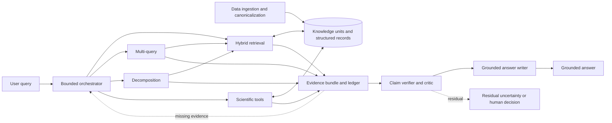

# Architecture

Materials RAG Lab keeps evidence preparation, retrieval, computation, verification, and answer writing as separate boundaries. Advanced workflows reuse the same retrieval corpus and lower-level tools used by the simpler baselines.

The detailed routing and next-action contract is documented in [Orchestration policy](orchestration_policy.md).

## Runtime boundaries

### Canonical evidence

Documents and typed engineering records are normalized into stable knowledge units with source provenance. Text retrieval units and structured numerical tables remain separate. Evaluation fixtures, gold labels, authoring registers, and hard-negative annotations are excluded from runtime retrieval.

### Retrieval tools

- **Dense retrieval** uses `BAAI/bge-base-en-v1.5` embeddings and exact cosine ranking. The project also validated an equivalent Qdrant backend.
- **BM25** uses deterministic Unicode-aware tokenization over the same 277 retrieval units.
- **Hybrid retrieval** fuses dense and BM25 rankings with Reciprocal Rank Fusion, `k=60`.
- **Multi-query** retrieves the original query plus three isolated reformulations, then applies second-stage RRF.
- **Decomposition** retrieves the original query plus independently searchable evidence needs, then applies second-stage RRF.

The orchestrator calls these tools; the tools do not plan or answer.

### Evidence state

An Evidence Ledger records explicit requirements and their observable support status. `MISSING` means unsupported by the supplied evidence bundle. It does not prove absence from the corpus or the wider literature.

Source evidence and derived computation receipts are distinct evidence kinds. Computation receipts are runtime artifacts and are never added to the semantic retrieval corpus.

### Scientific computation

The Scientific Analyst can request only registered typed operations. Deterministic code validates datasets, fields, filters, units, censoring policy, and operation type before emitting a provenance-bearing receipt. Arbitrary Python, shell, SQL, `eval`, and `exec` are outside the architecture.

### Verification and writing

The claim drafter proposes explicit claims from selected evidence. The verifier checks support, contradictions, revision status, numerical receipts, causal scope, and limitations. The answer writer receives verified claims and residuals only; it cannot retrieve or calculate.

In the frozen v0.1.0 path, claim drafting, verification, answer assembly, lexical answer evaluation, and reported numerical calculations are deterministic structured functions. Their prompt files are retained versioned interfaces and design provenance. The router, orchestrator, evidence assessor, and query transformations are model-backed roles. The Scientific Analyst model interface was implemented but had zero calls in the frozen probe and challenge results.

## Bounded autonomy

The frozen Agentic retrieval configuration uses:

- at most 4 retrieval actions;
- at most 6 orchestrator decisions;
- at most 2 query-transformation calls;
- at most 2 computation actions;
- duplicate `(tool, query)` rejection.

The retrieval loop stops when evidence is sufficient, a budget is exhausted, or available tools cannot support the remaining requirement. Verification does not reopen retrieval in the frozen architecture.

## Revision semantics

Revision status is resolved deterministically from canonical metadata. Superseded evidence may support a historical claim, such as what an earlier investigation proposed. It cannot by itself support a claim about the current approved conclusion.

## Trace model

Runtime traces contain observable events, identifiers, tool actions, evidence dispositions, and operational receipts. They exclude chain-of-thought, benchmark labels, gold evidence, oracle results, and offline metrics.

The approved static architecture is [`assets/hero_2_agentic_rag_architecture.png`](assets/hero_2_agentic_rag_architecture.png). The README also provides an animated overview with a static fallback.
